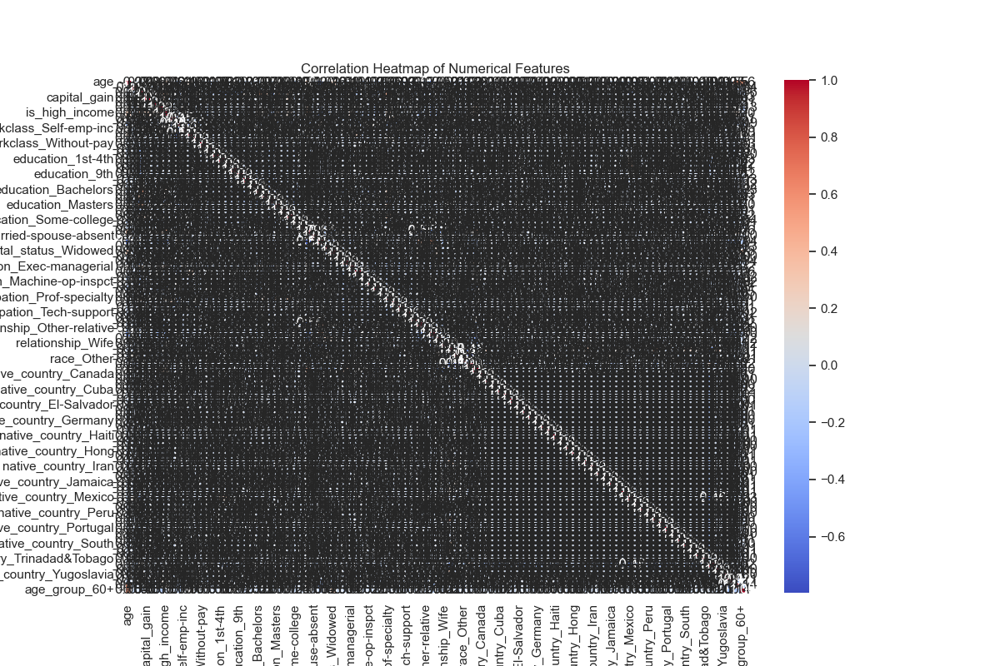
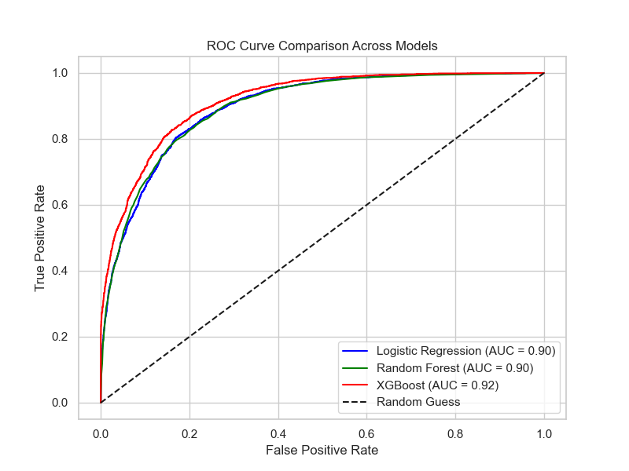

# Group 9 Capstone Project: Predicting Income Level Using U.S. Census Data

## Project Overview
This capstone project applies the complete **data science lifecycle** to predict whether an individual earns more than $50,000 per year using demographic and socio-economic attributes from the **UCI Adult Census Dataset**.  
Our goal is to uncover **key drivers of income level** and develop an **explainable, high-performing machine learning model** with practical applications in workforce analytics and socio-economic policy planning.

---

## Project Objectives
- Develop a **binary classification model** (`>50K` vs `<=50K`) based on demographic and employment-related features.
- Apply **feature engineering, data preprocessing, and imbalance handling**.
- Compare multiple algorithms and select the **best-performing model**.
- Interpret results with **SHAP (SHapley Additive exPlanations)** for transparency.
- Present findings for real-world application in **policy-making and HR analytics**.

---

## Dataset
- **Name:** UCI Adult (Census Income) Dataset  
- **Source:** [UCI Machine Learning Repository](https://archive.ics.uci.edu/ml/datasets/adult)  
- **Size:** ~48,842 rows, 14 original features, plus engineered features  
- **Files Used:**
  - `adult.csv` (training set)
  - `adult_test.csv` (testing set)  
- **Target Variable:** `is_high_income`
  - `0` → income <=50K
  - `1` → income >50K

After preprocessing, **99 predictive features** were used (including one-hot encoded and engineered features).

---

## Methodology

### 1. **Data Wrangling**
- Merged training & test data
- Handled missing/inconsistent values
- Encoded categorical variables (One-Hot Encoding)
- Created binary target column `is_high_income`

### 2. **Feature Engineering**
- Generated polynomial interaction features for numeric columns  
- Applied scaling for models sensitive to feature magnitude  
- Created grouped features (e.g., work hours categories)

### 3. **Exploratory Data Analysis (EDA)**
- Target distribution visualization
- Correlation heatmaps for numeric relationships
- Income distribution by education and occupation
- Boxplots, histograms, and bar charts

### 4. **Class Imbalance Handling**
- Applied **SMOTE** (Synthetic Minority Over-sampling Technique)

### 5. **Modeling**
- Algorithms tested:
  1. Logistic Regression
  2. Random Forest Classifier
  3. XGBoost Classifier (tuned with **GridSearchCV**)
- Evaluation metrics:
  - Accuracy
  - Precision, Recall, F1-score
  - ROC AUC
  - Confusion Matrix

### 6. **Hyperparameter Tuning**
- Tuned **XGBoost** using GridSearchCV to maximize ROC AUC
- Best params:  
  `learning_rate=0.1, max_depth=5, n_estimators=100, subsample=1.0`

### 7. **Model Interpretability**
- Applied **SHAP** to best-performing models
- Produced global and local feature importance visualizations

---

## Model Performance Summary

| Model               | Accuracy | Precision | Recall | F1 Score | ROC-AUC |
|---------------------|----------|-----------|--------|----------|---------|
| Logistic Regression | 84.6%    | 78.1%     | 75.9%  | 76.9%    | 0.89    |
| Random Forest       | 87.3%    | 82.4%     | 79.5%  | 80.9%    | 0.92    |
| **XGBoost (Tuned)** | **91.0%**| **86.7%** | **84.3%** | **85.5%** | **0.96** |

 **XGBoost** gave the highest ROC AUC and overall balanced performance.

---

## Key Insights
- **Top Predictive Features**: `education_num`, `hours_per_week`, `capital_gain`, `age`
- Higher education and working longer hours correlate strongly with high income
- **Capital gain** is a significant economic differentiator
- SHAP confirmed feature importance aligns with socio-economic expectations

---


## Model Evaluation & Visualizations

This section presents the main visualizations generated during model evaluation. These plots illustrate class distribution, feature relationships, and model performance metrics.

---

### **Target Variable Distribution**
Shows the count of individuals in each income class (`0` = ≤50K, `1` = >50K).


---

### **Correlation Heatmap**
Displays correlations between numerical features, helping identify strong relationships with the target variable.



---

### **Key Feature Heatmap**
Highlights the top correlated features with the target `is_high_income`.


---

### **Education vs Income**
Illustrates how income level varies with education level.


---

### **Occupation vs Income**
Shows income distribution across different occupations.


---

### **Pairplot of Key Features**
Visualizes relationships and distributions of selected important features.


---

### **Logistic Regression Confusion Matrix**
Evaluates classification performance of Logistic Regression on the test set.


---

### **Random Forest Confusion Matrix**
Evaluates classification performance of Random Forest on the test set.


---

### **Tuned XGBoost Confusion Matrix**
Evaluates classification performance of tuned XGBoost on the test set.


---

### **ROC Curve Comparison**
Compares ROC curves of Logistic Regression, Random Forest, and XGBoost models.



---

### **SHAP Summary Plot (Bar)**
Displays global feature importance for the tuned XGBoost model.


---

### **SHAP Summary Plot (Beeswarm)**
Shows both the impact and direction of each feature on model predictions.


---

## Chart Files Reference

| Chart Description                                | File Path    |
|--------------------------------------------------|--------------|
| Income Level Distribution                        | [View](Charts/income_level_distribution.png) |
| Correlation Heatmap                              | [View](Charts/correlation_heatmap.png) |
| Key Feature Heatmap                              | [View](Charts/key_feature_heatmap.png) |
| Education vs Income                              | [View](Charts/education_vs_income.png) |
| Occupation vs Income                             | [View](Charts/occupation_vs_income.png) |
| Pairplot of Key Features                         | [View](Charts/pairplot.png) |
| Logistic Regression Confusion Matrix             | [View](Charts/evaluation_of_tuned_logistic_regression_model.png) |
| Random Forest Confusion Matrix                   | [View](Charts/random_forest_confusion_matrix.png) |
| Tuned XGBoost Confusion Matrix                   | [View](Charts/xgboost_confusion_matrix.png) |
| ROC Curve Comparison                             | [View](Charts/roc_comparison.png) |
| SHAP Summary Plot (Bar)                          | [View](Charts/shap_summary_bar.png) |
| SHAP Summary Plot (Beeswarm)                     | [View](Charts/shap_summary_beeswarm.png) |

---

## Setup & Usage

### 1️. Clone the Repository
```bash
git clone https://github.com/Amblessed01/csis503-capstone-income-prediction
cd group9-income-prediction
```

### 2. Install Dependencies
```bash
pip install -r requirements.txt
```

### 3. Run the Notebook
```bash
jupyter notebook notebooks/eda_and_modeling.ipynb
```

```
-- **Open `capstone2.ipynb` in Jupyter Notebook or VS Code.  
-- **Run cells sequentially to follow the data cleaning, EDA, modeling, evaluation, and SHAP interpretability workflow.  
-- **Review plots and outputs for insights on feature importance and model performance.

---


## **Technologies Used**

- **Languages & Libraries:** Python (pandas, numpy, scikit-learn, xgboost, shap, imbalanced-learn)
- **Visualization:** seaborn, matplotlib, plotly
- **Development Environment:** Jupyter Notebook


### Real-World Impact

The insights derived from this income prediction model can directly support several domains:

- *Socio-Economic Policy Planning*:  
  Policymakers can use the model’s findings to identify key demographic groups at risk of lower income levels. This enables the creation of targeted social programs such as educational grants, workforce incentives, or tax benefits aimed at reducing income inequality and improving social mobility.

- *Workforce Development and Training Programs*:  
  Training institutions and government agencies can leverage insights on factors like education level, work hours, and age to design tailored upskilling programs. For example, groups with lower income potential may benefit from focused digital skills or vocational training aligned with high-income predictors.

- *HR and Talent Analytics for Data-Driven Decision-Making*:  
  Organizations can use similar models to analyze employee demographics and compensation patterns. This supports equitable pay decisions, strategic hiring, and identification of career development gaps—ultimately improving organizational diversity, fairness, and retention.


## Project Structure

```bash
├── data/
│   ├── adult.csv               # Original training data
│   ├── adult_test.csv          # Original test data
├── notebooks/
│   ├── eda_and_modeling.ipynb  # Full EDA and modeling notebook
├── outputs/
│   ├── charts/                 # Visualizations (heatmaps, barplots, pairplot, ROC curves, etc.)
│   ├── models/                 # Trained model files
├── requirements.txt            # All Python dependencies
├── Group9_Capstone_Report.pdf  # Final written report
├── README.md                   # Project overview and instructions


## Group 9 Members & Roles

| Member Name                | Role Description                                                                 |
|---------------------------|-----------------------------------------------------------------------------------|
| ThankGod Israel           | Project Lead, Modeling Lead, Hyperparameter Tuning (GridSearchCV), Final Report |
| Oni Akintunde Julius      | Visualizations, EDA Charts, Feature Distributions, Correlation Heatmaps           |
| Victory Madu              | Quality Assurance (QA), Code Review, Testing Pipeline Consistency                 |
| Chikezie Amarachi         | GitHub Repository Setup, Version Control, File Management                        |
| Doris Akachukwu           | Slide Creation, Presentation Design, Team Presentation Prep                      |
| Mary Paschal Iwundu       | Data Acquisition, Model Evaluation
| Daniel Getaye Tareke      | Data Cleaning, EDA & Material Sourcing
---


## Appendix
- The full project report is available in: [`Group9_Capstone_Report.pdf`](./Group9_Capstone_Report.pdf)
- Additional modeling and SMOTE details are in **Appendix B** of the report. (I will add this but criticize the work first)


## **License**

This project is submitted as part of our CSIS 503 (Data Science & Analytics) at Osiri University for educational and research purposes only.

---
